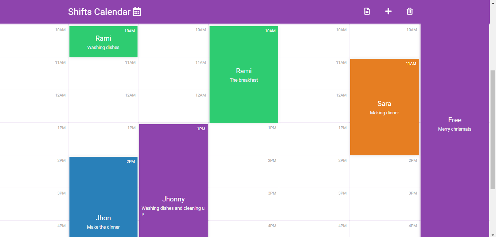

<h1 class="text-center">"Shift Calendar"</h1>
<h2>About this app</h2>

The shift calendar is an app to register your worker's shifts at youworkplace. Like if "Jhon" will work
  from 9 AM - 12 PM you can register that on the app. This app can jushave one shift at a time. Like at 10 AM
  its Jhon shift. So you can not add another shift.

<h2>How does this app works ?</h2>

This app uses your local storage to save data. The data is not saveon the server. The only one that can see
  the shifts is the one who has access to your computer.   
  To add a shift on the button add an shift on top. Or you can click on anytable cell and click add shift to add a shift on that time. And the register the name, description, hour, day
  and expend time. The description is not required.
    The expend time is how many hours in additional someone wilwork. If you leave at zero it means that
  the
  shift will be just one hour. If you leave it at two it means the shift will be three hours.
   And you can pick the color of your shift

<h2>About the code</h2>

This app/ webpage is made with pure Javascript and HTML, CSS. This apdoes not use any external libraries.
Or any server-side technology.  The app fonts are from <a href="https://fonts.google.com/" target="_blank">google fonts</a> and icons are from <a href="https://fontawesome.com/" target="_blank">font awsome</a>
  For live preview: <a href="https://rami-alkawadri.github.io/Shift-calendar/" target="_blank">https://rami-alkawadri.github.io/Shift-calendar/</a>

